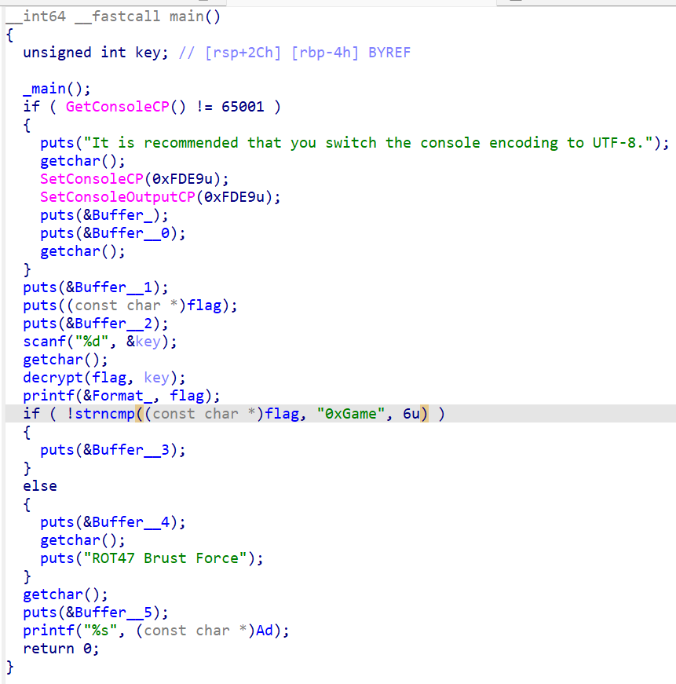
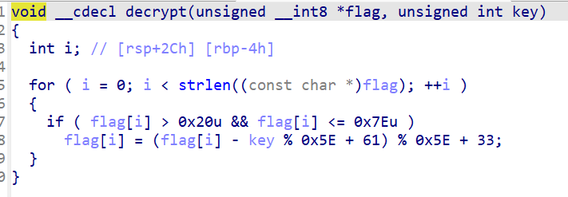

ida 的使用，和一些练习题

<!--more-->


## CTF+ [SignIn2](https://www.ctfplus.cn/problem-detail/1975492223294246912/description)
### 标签 0xGame2025 re week1

将题目提供的exe 文件拖入ida 中 main 函数 和其中 flag 解密函数的伪代码如图




找到flag的原始数据如下
```txt
 ; flag
.data:00000001400035EB                 db 40h, 7Dh, 43h, 6Fh, 42h, 6Fh, 2Ah, 79h, 71h, 21h, 2Ah
.data:00000001400035F6                 db 79h, 7Eh, 2Ah, 79h, 75h, 6Fh, 2 dup(23h), 6Fh, 41h
.data:0000000140003600                 db 40h, 46h, 40h, 2 dup(44h), 49h, 45h, 40h, 49h, 2Fh
.data:000000014000360A                 db 0
```

同时观察算法发现 这是一个带密钥的ROT47变种算法

#### note：
ROT47 是一个类似于 ROT13 的简单字符替换密码，它将可打印的 ASCII 字符集（从 ! 到 ~）整体向后移动 47 个位置。由于这个字符集总共有 94 个字符
，所以应用 ROT47 两次（即移动 94 个位置）就能还原出原始文本。

于是推出解密脚本 暴力破解key

```python
flag_bytes = [
  0x40, 0x2A, 0x57, 0x71, 0x7D, 0x75, 0x2D, 0x67, 0x75, 0x41, 0x73,
  0x40, 0x7D, 0x43, 0x6F, 0x42, 0x6F, 0x2A, 0x79, 0x71, 0x21, 0x2A,
  0x79, 0x7E, 0x2A, 0x79, 0x75, 0x6F, 0x23, 0x23, 0x6F, 0x41, 0x40,
  0x46, 0x40, 0x44, 0x44, 0x49, 0x45, 0x40, 0x49, 0x2F
]

expected = "0xGame"
expected_bytes = [ord(c) for c in expected]

def find_key(encrypted, expected):
  for key in range(94):
    match = True

    for i in range(len(expected)):
      if encrypted[i] > 0x20 and encrypted[i] <= 0x7e:
        decrypted = (encrypted[i] - key + 61) % 94 + 33
        if decrypted != expected_bytes[i]:
          match = False
          break
    
    if match:
      return key
  
  return None

correct_key = find_key(flag_bytes, expected)
print(f"正确的key值: {correct_key}")

def decrypt(flag_bytes, key):
  res = []
  for byte in flag_bytes:
    if byte > 0x20 and byte <= 0x7e:
      decrypted = (byte - key + 61) % 94 + 33
      res.append(chr(decrypted))
    else:
      res.append(chr(byte))
  
  return ''.join(res)

if correct_key is not None:
  decrypted_flag = decrypt(flag_bytes, correct_key)
  print(f"解密后的flag: {decrypted_flag}")
else:
  print("未找到正确的key")

```

找到key值 16
最终找到flag: 0xGame{We1c0m3_2_xiaoxinxie_qq_1060449509} 