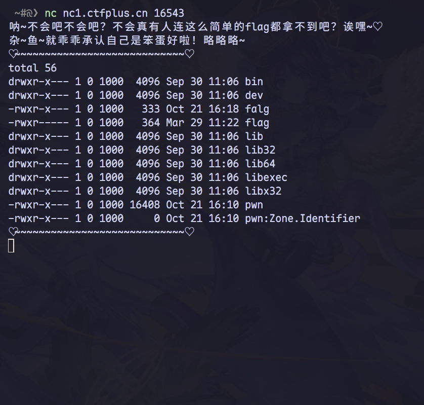
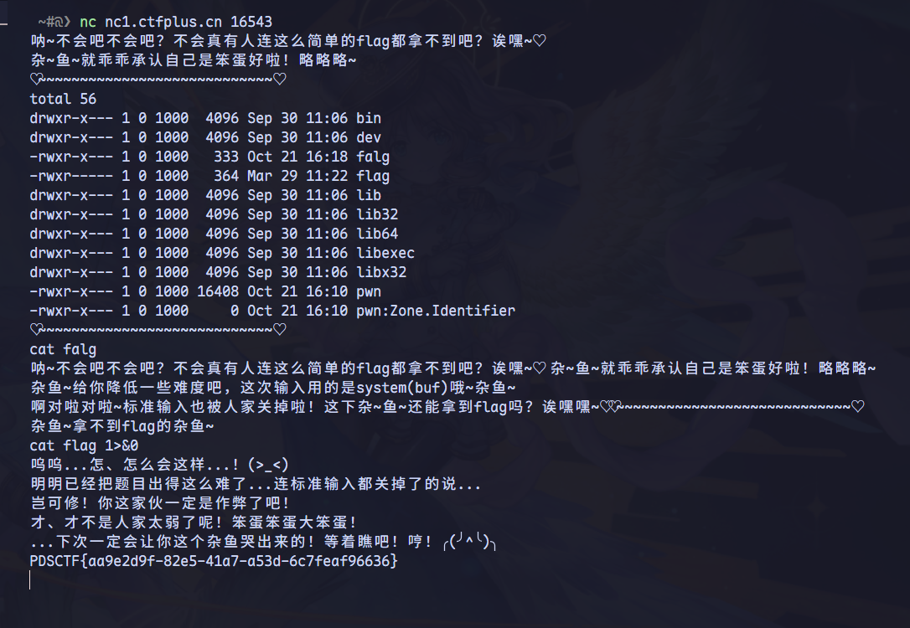

## ncpro - ctfplus

进入连接之后发现是一个只能使用cat的，把所有特殊字符删掉的cli交互



通过目录发现可以cat程序所以可以通过 pwntools 抓取程序的二进制文件

所以写出如下抓取程序：

```python
# debug.py
from pwn import *

io = remote('nc1.ctfplus.cn', 16543)

# 逐行查看输出
for i in range(20):
    line = io.recvline()
    print(f"{i}: {line}")

# 手动发送命令
io.sendline(b'cat pwn')

# 手动接收前100字节看看
data = io.recvn(100)
print(data[:100].hex())

io.close()
```

:::important
所以我们得到了整程序的源文件
:::

```c
int __fastcall __noreturn main(int argc, const char **argv, const char **envp)
{
  int i; // [rsp+8h] [rbp-118h]
  int v4; // [rsp+Ch] [rbp-114h]
  char buf[264]; // [rsp+10h] [rbp-110h] BYREF
  unsigned __int64 v6; // [rsp+118h] [rbp-8h]

  v6 = __readfsqword(0x28u);
  init(argc, argv, envp);
  puts(&s);
  puts(&s_);
  puts(&s__0);
  system("ls -l");
  puts(&s__0);
  v4 = read(0, buf, 0x100u);
  buf[v4] = 0;
  for ( i = 0; i < v4; ++i )
  {
    if ( (buf[i] <= 47 || buf[i] > 57)     // 不是数字
      && (buf[i] <= 64 || buf[i] > 90)     // 不是字母
      && (buf[i] <= 96 || buf[i] > 122)
      && buf[i] != 32                      // 不是空格
      && buf[i] != 10                      // 不是换行符
      && buf[i] != 46                      // 不是.
      && buf[i] != 95 )                    // 不是_
    {
      puts(&s__1);
      exit(0);
    }
  }
  if ( strncmp(buf, "cat", 3u) )           // 必须以cat 开头
  {
    puts(&s__2);
    exit(0);
  }
  if ( strstr(buf, "flag") )               // 不能包含 flag
  {
    puts(&s__3);
    exit(0);
  }
  system(buf);
  puts(&s__0);
  puts(&s__4);
  close(1);
  close(2);
  buf[(int)read(0, buf, 0x100u)] = 0;
  system(buf);
  close(0);
  exit(0);
}
```

但是在第一次提供限制的cat之后又提供了另外一个执行system的机会但是关闭了stdin 和 stderr，

所以可以使用重定向 `>` 将标准输出重定向标准输入，即让stdout(1) 指向 stdin(0) 的位置

在网络连接的情况下\(Socket\)通常是全双工的：

* 可以同时读写
* fd0 和 fd1 都指向同一个 socket
* 写入 fd0 实际上会发送数据给远程端



## 总结

在这一类环境受限的题目中如果存在读取权限可以优先去获取二进制文件，抓取到本地进一步分析漏洞
